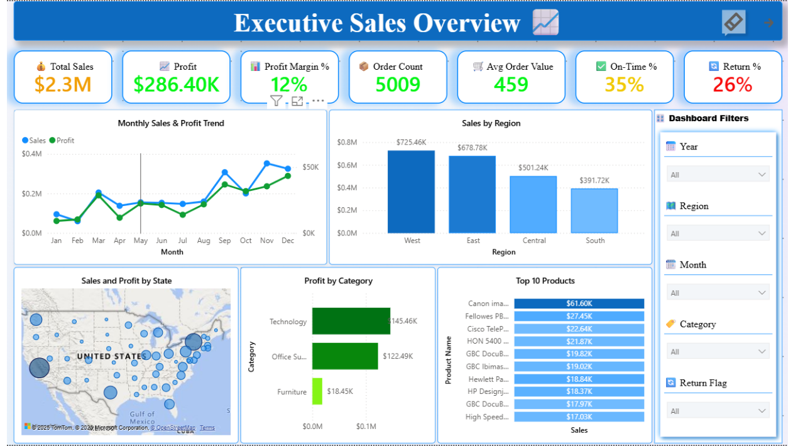
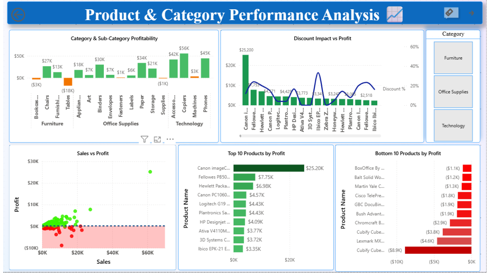
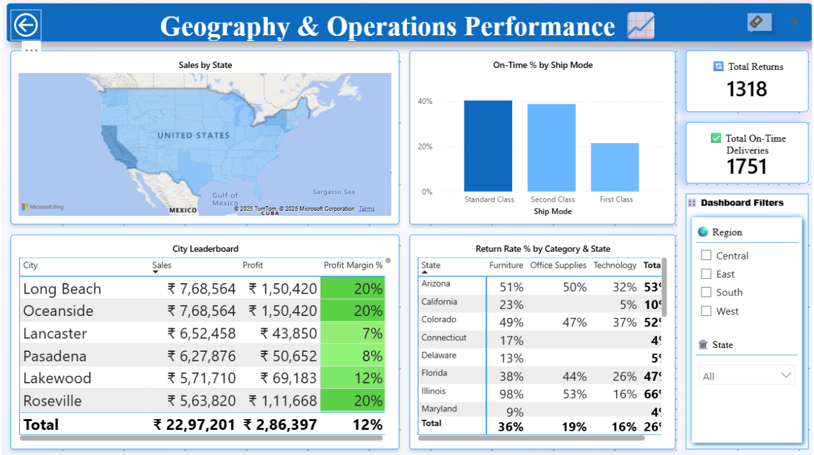
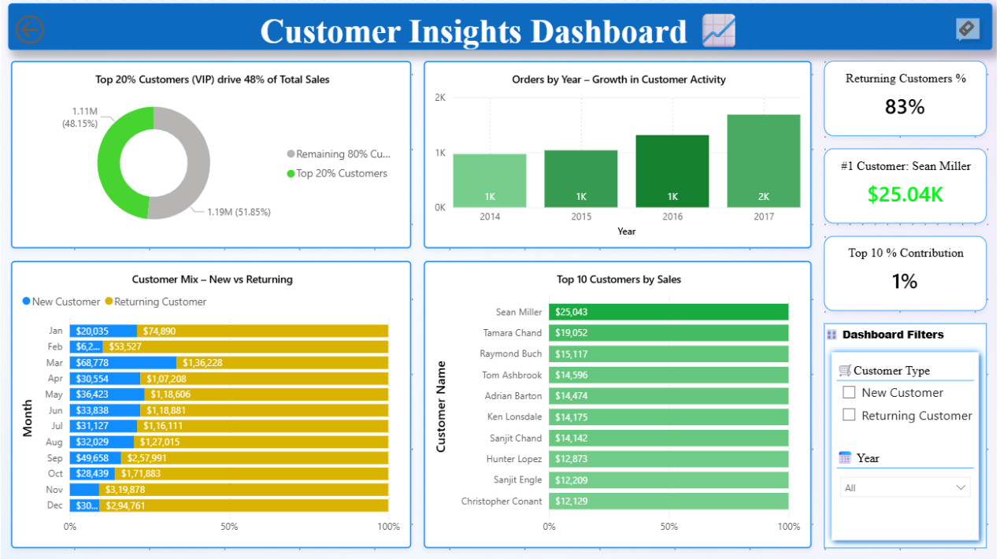

 # 🏬 Retail Superstore Business Performance Analysis (Power BI Case Study)

---

## 🧾 Project Overview
This project analyzes retail sales data from the **Superstore dataset** to uncover insights into **sales performance, profitability, customer retention, and operational efficiency**.  

As a business analyst, my goal was to transform raw transactional data into actionable insights using **Power BI**, demonstrating skills in **ETL (Power Query)**, **Data Modeling**, **DAX**, and **Dashboard Design**.  

The project follows a **case-study framework**:
> **Ask → Prepare → Model → Analyze → Visualize → Share**

---

## 🎯 Business Objective
Provide data-driven insights to help management:
- Understand **regional, category, and customer-level performance**
- Identify **profitability drivers and inefficiencies**
- Optimize **returns, shipping, and discount strategies**
- Support **strategic decision-making** with interactive dashboards

---

## ⚙️ Tools & Skills Used

| Category | Tools/Techniques |
|-----------|-----------------|
| Data Cleaning | Power Query (ETL), Data Type Fixing, Column Derivation |
| Data Modeling | Star Schema Design (Fact + Dimensions), Relationships, Calendar Table |
| DAX Calculations | Time Intelligence (YoY, MoM), Profit Margin %, On-Time %, Return Rate |
| Dashboard Design | KPI Cards, Drill-Throughs, Interactive Filters |
| Visualization | Bar/Line Charts, Maps, Pareto Chart, Scatter, Donut Chart |
| Business Focus | Sales, Profitability, Returns, Customer Retention, Operations |

---

## 🧱 Data Modeling

A **Star Schema** was implemented in Power BI:

**Fact Table:** Orders  
**Dimension Tables:** Customers, Products, Date, Geography, Shipping SLA

Relationships were created between Customers, Products, Dates, and Orders to enable time-based and regional analysis.

---

## 🧮 DAX Measures
Some key measures created:
- `Total Sales = SUM(Orders[Sales])`
- `Total Profit = SUM(Orders[Profit])`
- `Profit Margin % = [Total Profit] / [Total Sales]`
- `YoY Sales Growth`
- `Avg Order Value`
- `On-Time Delivery %`
- `Return Rate %`
- `Sales Share %` and `Pareto 80/20`

---

## 📊 Dashboard Overview

### Page 1 – Executive Overview
KPIs: Total Sales ($2.3M), Profit ($286K), Profit Margin (12%), Orders (5009), On-Time %, Return %  
Visuals: Monthly Trends, Sales by Region, Profit by Category, Top Products, Sales Map  

---

### Page 2 – Product & Category Analysis
Category-wise Profitability, Discount Impact, Top/Bottom 10 Products, Sales vs Profit Scatter  

---

### Page 3 – Geography & Operations
Regional and City-level breakdown, Delivery Timeliness, Return % by Category  

---

### Page 4 – Customer Insights
Customer segmentation, new vs returning users, Pareto 80/20, and top customers  

---

## 💡 Key Insights

| Area | Insight |
|------|----------|
| Sales Performance | Total Sales = **$2.3M** with **12% average profit margin** |
| Customer Insights | Top 20% customers generate **48% of sales (Pareto principle)** |
| Profitability | **Furniture (Chairs)** had strong sales but negative profit margins due to over-discounting |
| Shipping | **Standard Class** achieved the highest on-time rate |
| Geography | **California & New York** led in sales; **Arizona** had the highest return rate |

---

## 📘 Project Files

| File | Description |
|------|-------------|
| `Superstore_Sales_Performance_Dashboard.pbix` | Full interactive Power BI dashboard |
| `Superstore_sales_data.csv` | Raw dataset used for analysis |
| `Visuals/` | Screenshots of dashboard pages |
| `Retail_Superstore_Case_Brief.pdf` | Company-style one-page case brief|

---

## 🧠 Learnings
- Developed strong understanding of **data modeling and ETL best practices**
- Created **executive-level dashboards** with performance KPIs and drill-throughs
- Practiced translating technical metrics into **clear business narratives**
- Applied **visual storytelling** principles for better insight communication

---

## 🧑‍💻 Author
**Pawan Yadav**  
Data Analyst | Power BI | SQL | DAX | Data Modeling  

📧 Email: [pawanya28@gmail.com](mailto:pawanya28@gmail.com)  
🔗 [LinkedIn](https://www.linkedin.com/in/pawan-yadav-b59826383)

---

> *A complete business intelligence project demonstrating the power of data-driven storytelling and dashboard design for real-world retail decision-making.*
